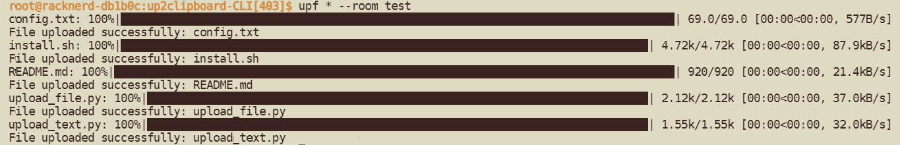

<p align="center">English | <a href="./README_zh.md">中文</a></p>

# Project Overview

Original project link: https://github.com/TransparentLC/cloud-clipboard

Cloud Clipboard can be installed using Docker:
```bash
docker pull lthero1/lthero-onlineclip:latest
docker container run -d -p 9501:9501 lthero1/lthero-onlineclip
```

This project extends the Cloud Clipboard project, providing CLI-based tools for uploading text and files.

The `install.sh` script facilitates the one-click deployment of this project.

# Download the Project

Use this command to download the project:
```bash
git clone https://gitclone.com/github.com/lthero-big/up2clipboard-CLI.git 
```
Alternatively, you can download the project manually.

Navigate to the project directory:
```bash
cd ./up2clipboard-CLI
```

# Configuration Changes
Open `config.txt` with `vim` or `nano`, and replace the domain URL (`https://clip.yourDomain.com`) with your own, such as `https://clip.lthero.me`.

You can customize `upt` and `upf` to your preferred names.

The modified configuration file should look like this:
```bash
upload_url=https://clip.lthero.me
bin_upt_name=upt
bin_upf_name=upf
```

# Run the Installation Script
Grant execution permissions to `install.sh`, then execute it:
```bash
sudo chmod +x install.sh
sudo ./install.sh
```
Alternatively, you can directly execute it with:
```bash
sudo bash ./install.sh
```

The script will automatically install the required environment. After completion, you can use the commands below to operate the project.

# Upload Files
```bash
upf somefile.txt --room RoomName
upf --room 'RoomName' somefile.txt
upf --room RoomName file*
```

- `file*`: Supports wildcard characters
- **Does not support** entire folder uploads

# Upload Text

Supports various usage patterns:
```bash
upt 'Here is some text' --room RoomName
upt --room 'RoomName' 'Here is some text'
echo 'Sample text' | upt --room RoomName
cat notes.txt | upt
```

You can then visit `https://clip.lthero.me` to verify the upload success.

# Showcase
<p align="center"></p>


# Modify Configuration
Open `config.txt` with `vim` or `nano` to replace the domain with any new one, and adjust `bin_upt_name` and `bin_upf_name` to new values as well.

After that, simply rerun `install.sh` to apply the new settings.
