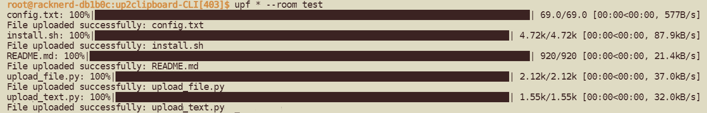

<p align="center"><a href="./README_en.md">English</a> | 中文</p>

# 本项目说明

原项目地址： https://github.com/TransparentLC/cloud-clipboard

cloud-clipboard使用docker安装
```
docker pull lthero1/lthero-onlineclip:latest
docker container run -d -p 9501:9501 lthero1/lthero-onlineclip
```

本项目基于clipboard项目，提供了基于CLI方式的上传文字、文件功能

其中，install.sh为一键部署本项目脚本


# 下载本项目

使用命令一键下载
```
git clone https://gitclone.com/github.com/lthero-big/up2clipboard-CLI.git 
```
或者手动下载本项目到本地


进入本项目目录
```sh
cd ./up2clipboard-CLI
```

# 配置修改
vim或nano打开`config.txt`，将里面的域名( https://clip.yourDomain.com )替换成自己的，如 https://clip.lthero.me

upt和upf可以自定义为你想用的名字

修改后的配置文件如下
```sh
upload_url=https://clip.lthero.me
bin_upt_name=upt
bin_upf_name=upf
```

# 运行安装文件
给`install.sh`执行权限，并运行
```sh
sudo chmod +x install.sh
sudo ./install.sh
```
或直接使用下面命令运行
```sh
sudo bash ./install.sh
```

脚本会自己安装需要的环境，运行完成后，即可使用下面的命令进行调用

# 上传文件

```sh
upf somefile.txt --room RoomName
upf --room 'RoomName' somefile.t
upf --room RoomName file*
```

* `file*`: 支持通符号
* **不支持**整个文件夹上传

# 上传文字

支持多种写法

```sh
upt 'Here is some text' --room RoomName
upt --room 'RoomName' 'Here is some text'
echo 'Sample text' | upt --room RoomName
cat notes.txt | upt
```

随后，可以访问 https://clip.lthero.me 查看是否上传成功

# 展示
<p align="center"></p>

# 修改配置
vim或nano打开`config.txt`，将里面的域名替换成任何新域名，bin_upt_name和bin_upf_name替换成新的值

随后重新执行install.sh即可


